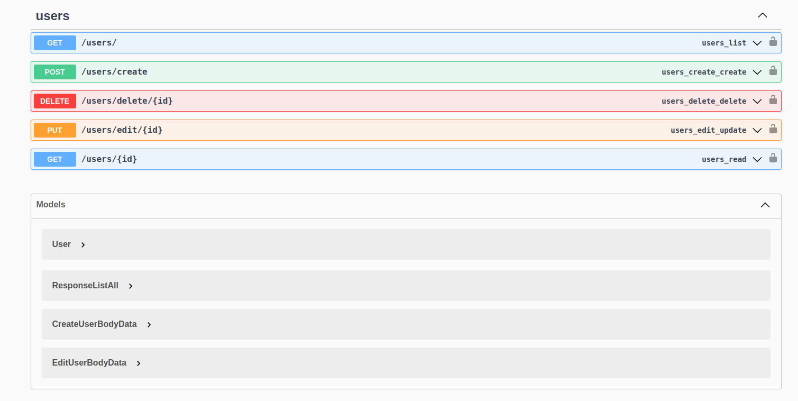
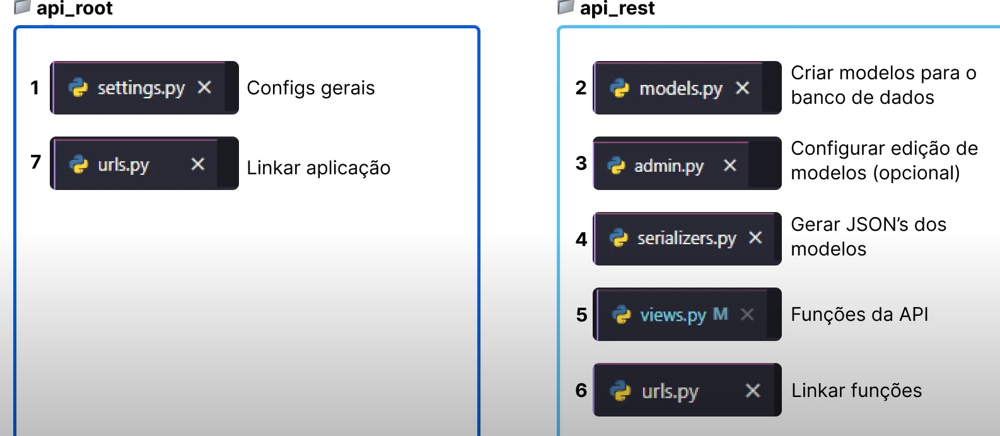

# python_first_api



### steps:

- init venv
- `pip install django djangorestframework django-cors-headers `
- `django-admin startproject <name_project>`
- add new module in `settings` -> `INSTALLED_APPS` and configs of `cors` and `djangorestframework`
- create models
- `python ./manage.py makemigrations`
- `python ./manage.py migrate`
- register model in `admin.py`
- `python ./manage.py createsuperuser`
- `python ./manage.py runserver`
- `python ./manage.py startapp <name_module>`
- create `serializers.py`
- create `views` and add views in `urls.py`
- test in browser `http://127.0.0.1:8000/api/users/?format=api`

### steps for connect sql server:

- `pip install mssql-django`
- [config environment linux for driver sql](https://learn.microsoft.com/en-us/sql/connect/odbc/linux-mac/installing-the-microsoft-odbc-driver-for-sql-server?view=sql-server-ver16&tabs=alpine18-install%2Cubuntu17-install%2Cdebian8-install%2Credhat7-13-install%2Crhel7-offline)
- [config settings database api](https://learn.microsoft.com/en-us/samples/azure-samples/mssql-django-samples/mssql-django-samples/)

### plugins vscode:

- python
- black formatter
- docker

### docker used

`docker run -e "ACCEPT_EULA=Y" -e "MSSQL_SA_PASSWORD=12345Sa';" \
-p 1433:1433 --name sql1 --hostname sql1 \
-d \
mcr.microsoft.com/mssql/server:2022-latest`

### structure files ex:



### version pip:

```
asgiref==3.8.1
Django==5.0.6
django-cors-headers==4.3.1
djangorestframework==3.15.1
mssql-django==1.5
pyodbc==5.1.0
pytz==2024.1
sqlparse==0.5.0
typing_extensions==4.11.0
```

### links

- [x] [Estrutura Básica de um Projeto em Django](https://www.youtube.com/watch?v=4u0aI-90KnU)
- [x] [DJANGO - Como CRIAR um Sistema de CADASTRO do ZERO!](https://www.youtube.com/watch?v=-m5ywU8SW9E)
- [x] [Try Create Python API Rest](https://dev.to/brian101co/how-to-return-a-json-response-in-django-gen)
- [ ] [Como criar uma API em Django - Criando um CRUD - Aula Completa](https://www.youtube.com/watch?v=Q2tEqNfgIXM)
